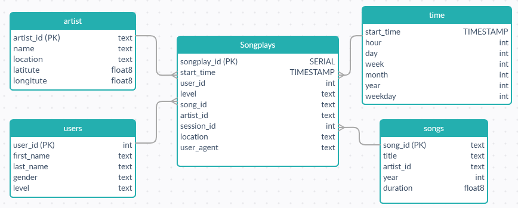
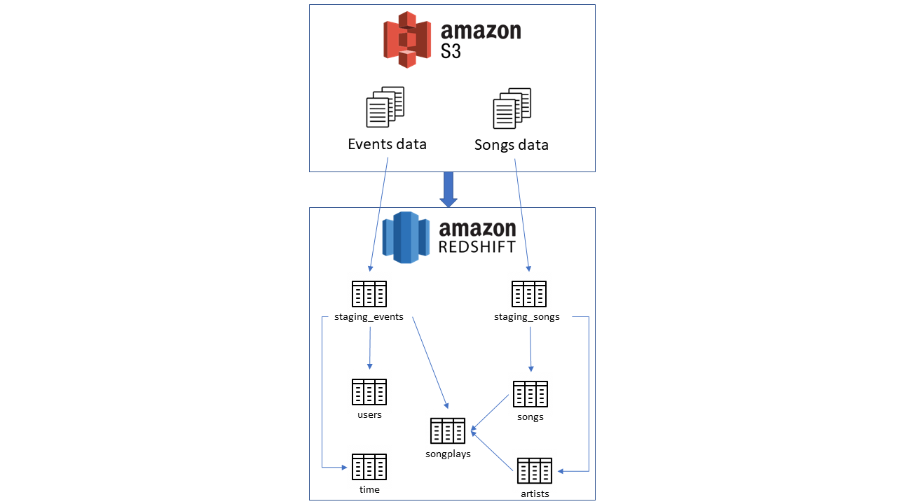

# Project Summary
## Introduction
A music streaming startup, **Sparkify**, has grown their user base and song database and want to move 
their processes and data onto the cloud. Their data resides in S3, in a directory of JSON logs 
on user activity on the app, as well as a directory with JSON metadata on the songs in their app.

As their data engineer, you are tasked with building an ETL pipeline that extracts their data 
from S3, stages them in Redshift, and transforms data into a set of dimensional tables for Sparkify 
analytics team to continue finding insights into what songs their users are listening to. You'll 
be able to test your database and ETL pipeline by running queries given to you by the analytics 
team from Sparkify and compare your results with their expected results.

## Description
The project includes initiation and deletion AWS Cluster, an ETL pipeline using Python to extract `song_data` 
and `log_data` from S3 bucket and load them to `sparkifydb` database in AWS Redshift cluster. 
And generate a Dashboard for data by executing queries and plotting with `matplotlib` package 
in `dashboard_months_activity_insight.py` and `dashboard_users_insight.py`.

## Database design in STAR schema


## Project AWS architecture design


# How to run Python file
## Step 0: AWS Credentials
Fill your AWS credential in `aws_credentials.cfg` 
```buildoutcfg
[AWS]
KEY=
SECRET=
TOKEN=

```
## Step 1: Initiating AWS services
Initiating AWS IAM Role, AWS Cluster, and Opening an incoming TCP port to access the cluster endpoint by 
executing a below line
```commandline
python create_cluster_iam__s3.py
```

## Step 2: Create sparkifydb and its tables 
Create the `sparkifydb` tables, which are songplays, artists, users, time, and songs tables into the database.
by running the `create_tables.py`

```commandline
python create_tables.py
```

## Step 2: Run ETL pipeline
Run the ETL pipelines to extracting, transform and load JSON files from S3 Bucket to the AWS Redshift Cluster 
initiated at Step 1
```commandline
python etl.py
```

## Step 3: Generate Dashboard
Run the `dashboard_users_insight.py` and `dashboard_months_activity_insight.py` by executing below lines
```commandline
python dashboard_users_insight.py
python dashboard_months_activity_insight.py
```

## Step 4: AWS Redshift cluster and IAM role deletion
Delete the Cluster and IAM role which are generated at Step 1
```commandline
python delete_cluster_iam_role.py
```


# Repository
## `s3://udacity-dend` S3 Bucket
The `s3://udacity-dend` S3 Bucket has 2 separate folders, 
* The `song_data` folder includes all JSON files need for `staging_songs`, `songs` and `artists` tables.
* The `log_data` folder includes all JSON files need for `staging_events`, `users`, and `time` tables.
```
└── s3://udacity-dend
    ├── log_data
    │   └── 2018
    │       └── 11
    │           ├── 2018-11-01-events.json
    │           ├── 2018-11-02-events.json
    │           └── ...
    └── song_data
        └── A
            ├── A
            │   ├── A
            │   │   ├── TRAAAAW128F429D538.json
            │   │   ├── TRAAABD128F429CF47.json
            │   │   └── ...
            │   ├── B
            │   │   ├── TRAABCL128F4286650.json
            │   │   ├── TRAABDL12903CAABBA.json
            │   │   └── ...
            │   └── C
            │       ├── TRAACCG128F92E8A55.json
            │       ├── TRAACER128F4290F96.json
            │       └── ...
            └── B
                ├── A
                │   ├── TRABACN128F425B784.json
                │   ├── TRABAFJ128F42AF24E.json
                │   └── ...
                ├── B
                │   ├── TRABBAM128F429D223.json
                │   ├── TRABBBV128F42967D7.json
                │   └── ...
                └── C
                    ├── TRABCAJ12903CDFCC2.json
                    ├── TRABCEC128F426456E.json
                    └── ...
```

